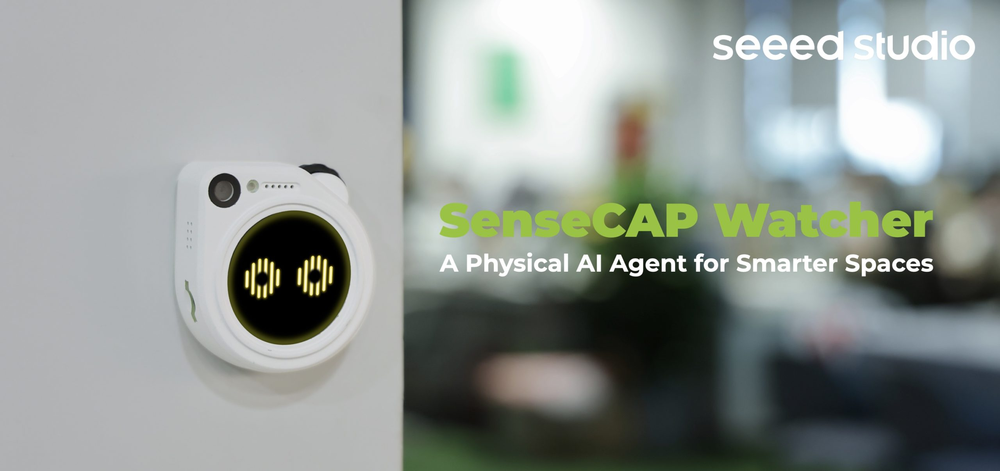

# SenseCAP Watcher出厂固件

SenseCAP Watcher是全球首个革命性的空间物理感知AI代理。这个项目是其出厂固件。

## 特性

- tinyML + LLMs（以及本地部署的LLM服务）
- 类似NODE-Red功能模块架构
- 基于工作流的任务执行
- 自然语言交互
- 高度交互式用户界面
- 可配置的SenseCraft App
- 固件OTA
- 更简便的模型训练

## 用户指南

请访问我们的[WiKi页面](https://wiki.seeedstudio.com/watcher/)了解如何使用。

## 开发者指南

1. [安装和首次构建](docs/installation_CN.md)
2. [软件架构](docs/architecture_CN.md)
3. [功能模块开发指南](docs/function_module_dev_guide_CN.md)
4. [UI开发指南](docs/UI_Intergration_Guide_CN.md)

## 征集贡献

我们热忱欢迎社区贡献。快来克隆代码仓库，进行首次构建。您可以通过提交Issue、发起PR请求或参与讨论新功能来参与其中。

您还可以在社交媒体上展示您的demo，使用Seeed Studio的标签。

- X: @seeedstudio
- Instagram: @seeedstudio
- LinkedIn: Seeed Studio

标签：#SenseCAPWatcher

## 软件许可

Apache 2.0许可证
