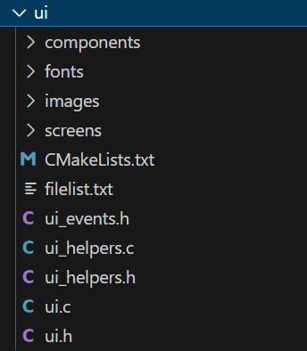

# UI Integration Guide

## Overview

In this guide, you will learn how to integrate your UI designs and related logic functions into the `view` component. All UI designs and logic functions are organized within the `view` component, which consists of two subcomponents: `ui` and `ui_manager`. Additionally, the `view` component includes the following files: `view.c`, `view.h`, `view_alarm.c`, `view_alarm.h`, `view_image_preview.c`, and `view_image_preview.h`.

  - view
    - ui
        - customed ui design files （Designed by Squareline tool or pure code）
    - ui_manager
        - animation.c
        - animation.h
        - pm.c
        - pm.h
        - ui_events.c
  - view.c
  - view.h
  - view_alarm.c
  - view_alarm.h
  - view_image_preview.c
  - view_image_preview.h

## ui Component

The `ui` subcomponent contains all user-designed UI elements. It includes definitions for various objects created within the UI.



## ui_manager Component
The `ui_manager` subcomponent contains logic functions, page navigation, and group management related to the UI.

### **1. animation.c**

This file contains functions for controlling scroll animations of objects in the main, template, and set pages.

```c
void main_scroll_cb(lv_event_t *e)
{
  // This callback function controls the scroll animation logic for different icons in the main page
}
```
**Note**: This callback function could also be implemented in `ui_events.c`. It is placed here to separate rendering logic from action logic.

### **2. ui_events.c**

Functions related to user interactions with UI elements, such as buttons, switches, image buttons, etc., are implemented in this file. It includes callback functions for various UI events triggered by these objects.

For example, in the ui_events.h:
```c
void main_clicked_cb(lv_event_t * e);
void main_focused_cb(lv_event_t * e);
```
And the code will be like:
```c
void main_clicked_cb(lv_event_t * e)
{

}
void main_focused_cb(lv_event_t * e)
{
  
}
```

### **3. pm.c**

Due to the inclusion of both touchscreen and encoder input devices in SenseCAP-Watcher, which may lead to conflicting actions, this file manages groups to resolve conflicts between actions from the two input devices. It includes functions for group management and handling input device actions.

```c

```

<!-- ## Example Usage

To integrate your UI, follow the structure and functions provided in the `view`, `ui`, and `ui_manager` components.

For example:

```c
// Add UI objects to the ui subcomponent
lv_obj_t *ui_mainbtn1;
lv_obj_t *ui_mainbtn2;

//...
``` -->


